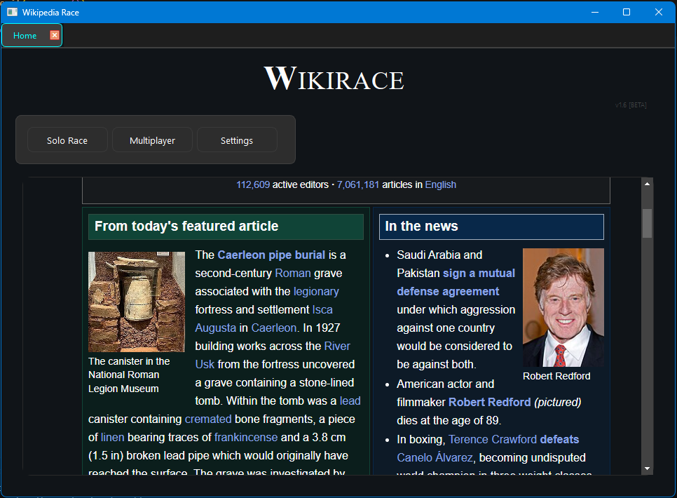
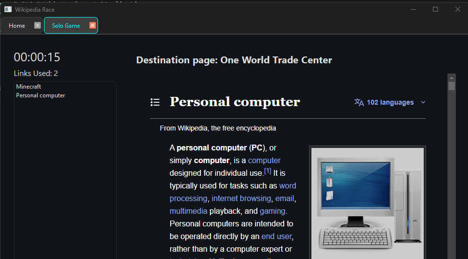

# WikiRace - A Desktop Wikipedia Race Application

> **Support Wikipedia**: If you enjoy using this app, please consider [donating to Wikipedia](https://donate.wikimedia.org/w/index.php) to help keep this valuable resource free and accessible to everyone.

## Project Information

- **Author**: Ian Wagers
- **Date Created**: February 13, 2023
- **Language**: Python

Note: This is an AI Driven (personal python project), the majority of the code was generated by ChatGPT to start, with additional support from Visual Studio's CoPilot

## Overview

WikiRace is a fun and educational game that challenges you to navigate from one Wikipedia page to another using only the links within the articles. Test your knowledge and strategy as you race against time to find the shortest path between two seemingly unrelated topics.

## Features

- **Solo Game Mode**: Race against the clock to reach the target page as quickly as possible.
- **Multiplayer Mode**: Compete with friends to see who can find the fastest path.
- **Modern GUI**: Built with PyQt6 for a smooth and responsive user experience.

## Screenshots

### Home Page

### Solo Race Game

## How to Use

### Getting Started

1. **Installation**: Follow the setup instructions in the `docs/` folder to install all dependencies
2. **Running the App**: Execute `python bin/main.py` or use the provided executable
3. **Choose Your Mode**: Select between Solo Game or Multiplayer from the main menu

### Solo Game Mode

1. **Start a New Game**: Click "Solo Game" from the main menu
2. **Set Your Target**: The app will randomly select a target Wikipedia page
3. **Begin Navigation**: Start from the current page and click links to navigate
4. **Race Against Time**: Try to reach the target page in as few clicks as possible
5. **Track Your Progress**: Monitor your path and time as you navigate

### Game Tips

- **Think Strategically**: Look for pages that might be conceptually related to your target
- **Use Categories**: Wikipedia categories can help you find related topics
- **Explore Connections**: Sometimes the most efficient path isn't the most obvious one
- **Learn as You Play**: Each game teaches you about new topics and connections

## Current Status

- ✅ The main homepage has been setup
- ✅ Solo games are functional and playable
- 🔄 Multiplayer mode is in development
- 🔄 Dark/Light Mode Settings (Work in Progress)
- 🔄 Additional features and improvements ongoing

## Technical Details

- **Framework**: PyQt6 for the GUI
- **Python Version**: 3.13
- **Dependencies**: See `pyproject.toml` for full requirements
- **Architecture**: Modular design with separate logic and GUI components

